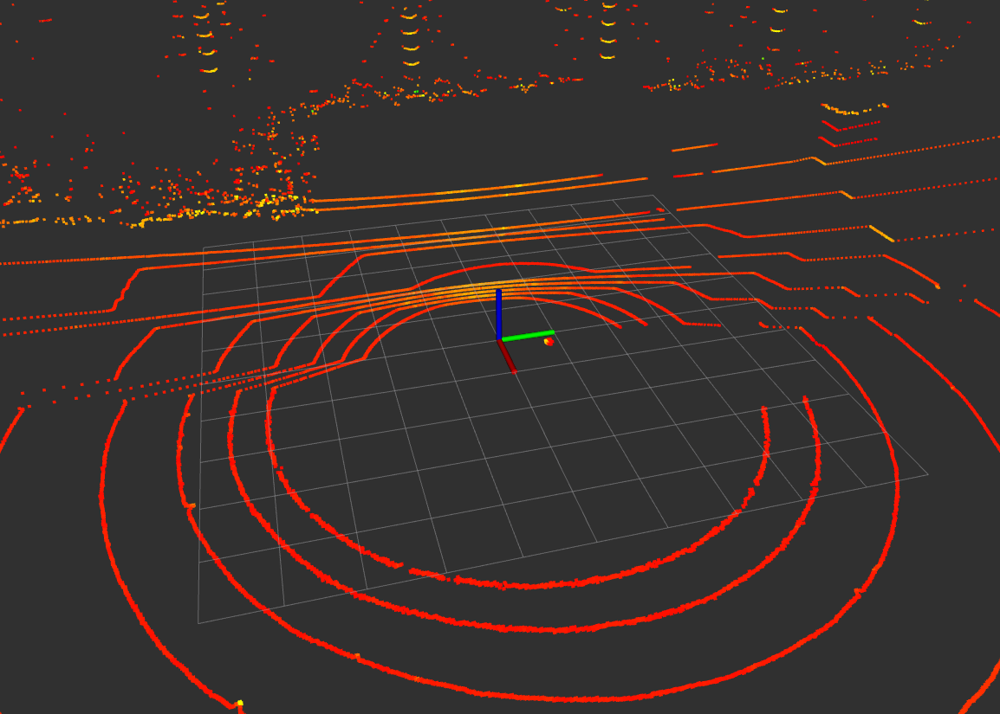
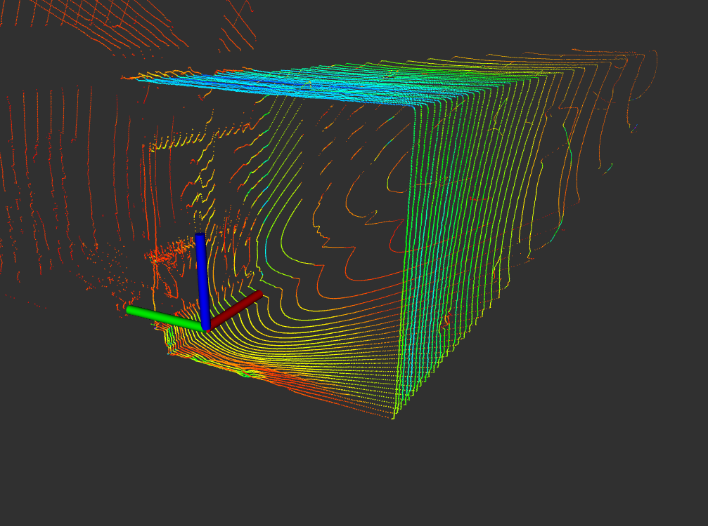

# edge_brush
road edge detection and  auto brushing using pid control 
采用数据集：滨海公园数据集

前雷达数据集：虚大走廊

## Edge Detection Part
  1. 首先对点云直通滤波，选择X和Z轴合适的点云
  2. 地面点标识，为后续可通行区域准备
  3. 提取1到5个ring，对其进行角点检测，设置上限和下限
  4. 对角点再根据距离选择，得到最合适的角点
  5. 5个角点ransac拟合直线，得到直线到车的距离，雷达系下表示
## Front RS-bpearl lidar Edge Detection
  1. 前雷达没有ring这个数据
  2. 前雷达安装存在问题，没有办法与地面保持水平
## PID Control Part
  1. 根据测量的D以及期望的距离作差，利用pid发送twist
  2. 只发送X:linear和Z:anguler
  3. 根据距离逻辑判断X和Z
  4. 这里注意检测的edge始终是车前4m的位置，可能会不好控制
## Kalman Prediction
  1. 车上的/odom_raw信息是轮式里程计信息，增量应该比较准
  2. 利用他来做卡尔曼预测未来的edge的位置
## Obstacle Avoiding Part
  1. 可通行区域变小后，采用避障策略
  2. 根据hdl全局定位，选择目标点为当前位置的5m
  3. 请求teb局部路径规划，到达目标点
  4. 继续继续沿边清扫
